## Chapter 5

# Middleware

Abstract
In the context of IT applications and especially in large organizations, integration of
existing information systems into new IT environments poses many challenges. One
of the biggest issue in this regard is dealing with the systems’heterogenity in terms
of used programming languages, operating systems, or even data formats. In order to
ensure communication between different information systems, developers must
establish common interfaces. This chapter introduces middleware as a type of
software which manages and facilitates interactions between applications across
computing platforms. Besides a brief definition and overview of middleware, several
of its characteristics are described. Furthermore, the differences between the three
middleware categories (message-oriented, transaction-oriented and object-oriented
middleware) are defined. In addition to these theoretical foundations, some practical
implementations are presented.

Learning Objectives of this Chapter
The primary learning objective of this chapter is toflesh out the concept, history, and
current use of middleware. The chapter’s main goal is to point out the difference
between transaction-oriented middleware, message-oriented middleware, and
object-oriented middleware. The subchapters present the key characteristics of
each of these categories and their commercial implementation. Students will also
learn about transaction processing monitors and remote procedure calls. The latter
will be explained step by step and contrasted with local procedure calls. Finally, the
chapter provides information about the well-known CORBA standard.

Structure of this Chapter
The chapter’sfirst section defines the overall concept of middleware and gives some
brief historical background. This section is followed by a description of the best-
known type of middleware: the remote procedure call. The third section forms
the main part of this work and gives an overview of the different categories
of middleware: message-oriented middleware, transaction-oriented middleware,
and object-oriented middleware. Definitions, functionalities, commercial
implementations, and well-known standards like CORBA are all included in the
middleware categories’descriptions. Thefinal section summarizes the whole chapter.

©Springer Nature Switzerland AG 2020
A. Sunyaev,Internet Computing, https://doi.org/10.1007/978-3-030-34957-8_

```
125
```

## 5.1 Introduction to Middleware

In today’s digitally interconnected world, infrastructures are becoming more com-
plex and diverse than ever before. At the same time, developers are facing increasing
demands from an equally heterogeneous assortment of consumers around the globe
for more powerful, reliable, and efficient applications. One way to facilitate the
development process and create moreflexible and reliable applications is to use
sophisticated middleware. Middleware refers to application-neutral programs that
mediate communication between applications in such a way that the complexity of
these applications and their infrastructure is hidden from the user. Middleware can
also be understood as a distribution platform (Ruh et al. 2002 ): It provides a solution
to developers seeking to integrate a collection of servers and applications into a
common service interface. From an application perspective, middleware is a service
layer, which is used instead of an operating system interface. This is an appropriate
course of action if the services offered are more powerful or the interface guarantees
platform independence. For instance, in the context of mobile computing,
middleware facilitates the development of platform-independent applications that
are developed once but can be used across different mobile operating systems (e.g.,
Android and iOS) or even accessed via the Web.
At present, the term tends to be associated with a specific service area and three
competing technologies. Two of these technologies are Common Object Request
Broker Architecture (CORBA) and Distributed Component Object Model (DCOM).
The most commonly used programming language, Java, contains a third, competing
technology called Remote Method Invocation (RMI). These technologies will be
discussed later in the chapter.
Middleware systems enable the distribution of applications to multiple computers
in the network. The concept of‘Web services,’which will be introduced in
Chapter 6 , can be seen as a special type of middleware systems. Web services are
an extension of the middleware concept, especially in terms of cross-organizational
data exchange, which is of particular interest in business-to-business integration. The
present chapter focuses on conventional types of middleware systems, which are
explained in detail in the subchapters below.

```
Middleware
Middleware is a type of software used to manage and facilitate interactions
between applications across computing platforms.
```
In other areas, the term middleware has a different meaning. For example, in the
field of computer game development, middleware may refer to subsystems for areas
like game physics. Such middleware is often produced and offered by third-party
developers.
The term itself has been in use since the late 1960s (Naur and Randell 1986 ). The
understanding of middleware as a solution to the problem of linking newer

126 5 Middleware


applications to older legacy systems gained popularity in the 1980s. However, the
answer to the question of what makes something middleware has changed over time.
The definition depends on the usage context and the level of abstraction in the
technology stack, which can range from the physical infrastructure and networking
components to the application and user interfaces. Application developers consider
everything below the application programming interface (API) as middleware.
Networking experts see everything above IP as middleware. Those working on
applications, tools, and mechanisms between these two extremes see it as located
somewhere between TCP and the API, with some classifying middleware even
further as application-specific upper middleware, generic middle middleware, or
resource-specific lower middleware. On frequent occasions, the point is made that
middleware often extends beyond the‘network’to the computer, storage capacity,
and other network-related resources (Aiken et al. 2000 ).
Middleware is also an essential building block of distributed systems. As shown
in Fig.5.1, the entire distributed system is a set of applications geared towards the
clients. In this example, the middleware goes unnoticed by the clients, but it is
responsible for connecting them with the servers. The middleware is connected via
an API to a set of applications. An API is a program part that a software system
(middleware in this example) makes available to other programs in order to connect
them in a simple way. APIs are software system programs that make particular
functionalities or services visible to clients while abstracting the details of how these
services are implemented. In this way, clients do not need to know about the
technical specifications of the underlying technical platforms. For example, the
middleware routes client requests to the appropriate servers.

```
ApplicaƟon ApplicaƟon
```
```
Plaƞorm
-OS
```
**- Hardware**

```
Middleware
(distributed system services)
```
```
APIs
```
```
Plaƞorm interfaces
```
**...
...**

```
Plaƞorm
-OS
```
**- Hardware**

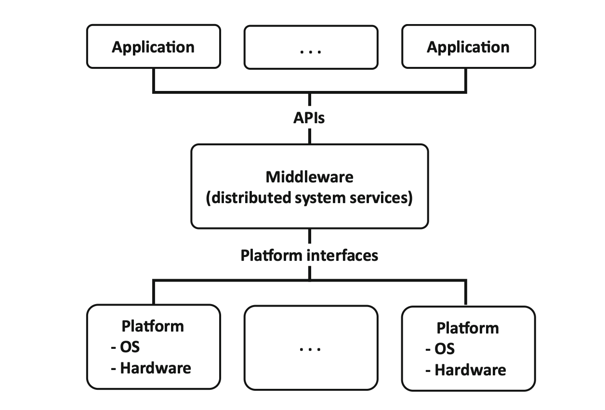

```
Fig. 5.1Middleware in a distributed system (adapted from Bernstein ( 1996 ))
```
5.1 Introduction to Middleware 127


Middleware tends to be a highly developed communication component
connecting client applications to servers. It can provide a wide range of services at
different levels of transparency and functionality and is a type of software that uses
defined interfaces or messages to facilitate the communication of requests between
applications. In addition, middleware provides the runtime environment to manage
the requests between applications (Ruh et al. 2002 ). It mediates between applications
in such a way that the complexity of these applications and their infrastructure is
concealed, and it offers services above the transport layer (i.e., TCP/IP) services but
below the application environment (Aiken et al. 2000 ). Middleware can also be
understood as a distribution platform (i.e., as a protocol or a protocol bundle on a
layer higher than that of ordinary computer communication). While lower-level
network services handle simple communication between computers, middleware
supports communication between applications.
Behind the idea of middleware is the core problem of integrating not only
proprietary applications’legacy applications but also their data, which are devel-
oped, distributed, and run on different hardware/software platforms and for different
purposes. It is becoming increasingly necessary to develop holistic, integrated
applications from existing functions and components. In the Internet age in partic-
ular, software concepts and technologies are needed for continuous adaptation and
further development and to abstract from the details of the relevant implementation.
The primary goal of middleware is to master distributed application systems’
complexity by means of a uniform abstract intermediate layer. This basic idea
goes back to the early stages of computer science andfirst appeared in print in the
late 1960s. However, it was only from the 1980s onward, with the emergence of
networking and distributed systems and the associated complexity of increasingly
cross-company and cross-organizational applications, that middleware became an
important and central researchfield and a developmental focus of (business) com-
puter science. Since the 1990s, a number of commercial and non-commercial
middleware concepts and products have been available. They form the basis for
the development of complex distributed applications today.
In general, middleware has to offer a range of services and interface functions that
allow distributed applications to interact and cooperate across network boundaries.
Important aspects include the provision of local transparency, which means hiding
the distribution, as well as independence from the specifics of the programming
language, networks, communication protocols, operating systems, and hardware
(see Fig.5.2).

128 5 Middleware


Middleware works at a high level within the layer model. It transports complex
data, connects function calls between the components, and establishes transaction
security. Middleware software is available as standard from several companies,
including IBM, Oracle, and Microsoft. On the application layer, it might be impos-
sible for application A to communicate with application B. For various reasons, this
communication could be rooted in different programming languages. Applications
that want to use the middleware layer to communicate with each other can use these
interfaces. The middleware software component will forward the corresponding
calls via a network. Usually, standard protocols like IP and TCP are used.

## 5.2 Remote Procedure Call

Remote Procedure Call (RPC) is the most basic type of middleware (Alonso et al.
2004 ). It allows for functions to be called in other address spaces (frequently on
another computer on a shared network). Usually, the called functions and the calling
program are not executed on the same computer. There are many implementations of
this technique, and they tend not to be compatible with each other.

```
Remote Procedure Call
A remote procedure call is the synchronous language-level transfer of control
between programs in disjoint address spaces whose primary communication
medium is a narrow channel (Nelson 1981 ).
```
```
applicaƟon
```
```
Middleware
```
- **CGI**
- **CORBA**
- **DCOM**

```
OperaƟng System
```
```
Hardware
```
```
Computer Network
```
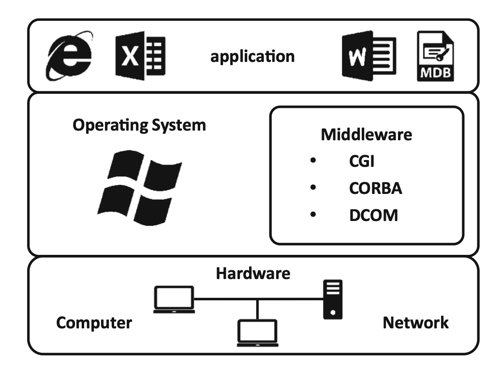

```
Fig. 5.2 Middleware in a layer model
```
5.2 Remote Procedure Call 129


The general idea of a procedure callfits the request–response pattern of the client-
server model (see Chapter 2 ). The client makes a request to some external code,
sleeps, andfinds the result after control is returned to the procedure. Thus, procedure
calls constitute a natural programming abstraction for the request–response message
exchange pattern.
James E. White presented thefirst concepts of RPC in a technical report in 1976
(White 1976 ), and in 1994 Andrew Birrell and Bruce Nelson received the ACM
Software System Award for developing RPC (ACM 2017 ). The most widely used
variant is the Open Networking (OPC) RPC, which is often referred to as Sun RPC
because it was originally developed by Sun Microsystems for its Network File
System (NFS). For this RPC variant, there is also an implementation in Linux.
Besides ONC RPC, the Distributed Computing Environment (DCE) RPC is also
widely used. Microsoft derived Microsoft RPC (MSRPC) from the DCE RPC 1.
reference implementation. Microsoft’s proprietary DCOM technology was later
implemented on this basis. DCOM-related experiences contributed to the develop-
ment of .NET Remoting.
In order to understand procedure calls, it is essential to understand the functioning
and merits of RPC. These calls are usually bound to a process’s address space, which
is allocated by the operating system. Hence, a procedure can only be called if it is
linked to an address in this space. The idea behind calling a procedure is to make it
accessible at a certain address in a process’s address space. Luckily, in high-level
languages such as C/C++, Java, C#, etc., developers do not have to take care of all
the technical details of the procedure call since the compiler automatically generates
the machine-level instructions for the procedure call.‘Normal’procedure calls are
limited to procedure calls in the same address space, like the calling code, so they can
only make procedure calls within a process. To solve this problem, RPC offers a
generalized notation of a procedure call to other processes–for example, a client call
to a procedure in a remote process or even in a remote machine. Developers typically
use the term to refer to remote procedure calls, regardless of whether the procedure
resides in a different process on the same machine or in a process on another
machine. However, in the context of Microsoft’s DCOM middleware, the notion
of local procedure calls (LPCs) is well-known but misleadingly refers to calls of a
remote procedure hosted in a different process on the same local machine. The
reason for this distinction is that communication with processes on the same machine
can be implemented in more efficient ways since no communication via the network
is required (see Fig.5.3). However, such a‘local’remote procedure call is still not
the same as a (normal) procedure call within the same address space because it
involves inter-process communication between different address spaces.

130 5 Middleware


It can, however, be supported by the operating system kernel, for instance, by
copying chunks of memory from the address space of one process to the address
space of another process. This still imposes an overhead, but the overhead is much
smaller than for a remote machine.
Besides local procedure calls, the use of RPC in the context of distributed systems
follows a common approach (Alonso et al. 2004 ). To set up an RPC, developers have
to use the interface definition language (IDL). IDL is used to set up communications
between clients and servers in RPC. Developers use an IDL to specify the interface
between a client and a server so that the RPC mechanism can create the code stubs
needed to call functions across the network. Stubs are interfaces that simulate the
existing code’s behavior. The stubs are interfaces between the client and the server
and make the called procedures work like local procedures on both sides. To create
code stubs, any middleware using RPC or a similar concept provides an interface
compiler, which typically produces client stubs, server stubs, code templates, and
references (Alonso et al. 2004 ).
The stub may be created in the user’s program and comprise remote calls of
procedures prior to the program run (preprocessing). After it has been created, the
stub resides in the operating system, a library, or a runtime system of the user’s
program (Czaja 2018 ). The client and server stubs are subprograms consisting of two
modules tasked with: (1) transmitting and (2) receiving. Communication between
the client and the server is done by stubs on both sides (see Fig.5.4). It means the

```
Request messages
```
```
arguments
```
```
results
```
```
Client
```
- **calling**
- **procedure**
    - **calling**
    - **procedure**

```
Local Procedure Call
Server
```
```
Remote Procedure Call
Client Server
```
```
Client Stub Server Stub
```
- **network**
- **transport**
    - **network**
    - **transport**

```
reply messages
```
```
argumentsresults argumentsresults
```
```
Network
```
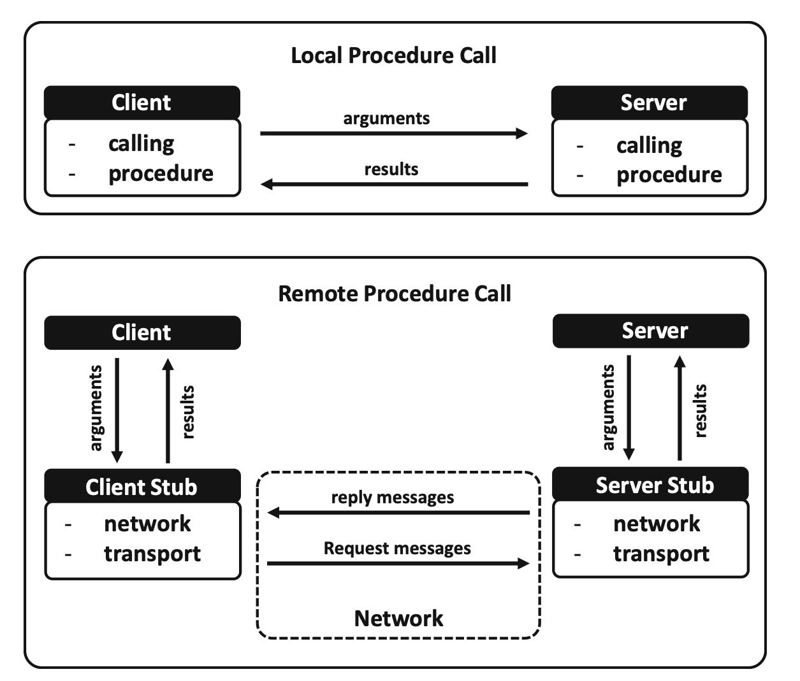
```
Fig. 5.3 Local procedure call vs. remote procedure call (adapted from Muppidi et al. ( 1996 ))
```
5.2 Remote Procedure Call 131


stubs do not contain the procedures as such. In other words, the stub is a placeholder
or proxy for the actual procedure implemented at the server.
The client stub transforms the procedure call into the required form to the server
to reproduce it on the server side, execute the call to obtain the results, and,finally,
reproduce these results on the client side. When the client calls a remote procedure,
the call that is actually executed is a local call to the procedure provided by the stub.
The stub then locates the server (i.e., it binds the call to a server), formats the data
appropriately (which involves marshaling and serializing the data), communicates
with the server, receives a response, and forwards that response as the return
parameter of the procedure invoked by the client (Alonso et al. 2004 ). In this case,
marshaling is the packing of procedure parameters into a message packet, which
could be interpreted by the systems involved (Huang et al. 2010 ).
The server stub is the counterpart to the client stub. It implements the server side
of the invocation and also receives invocations from the client side. The received
invocation is formatted in the format for the procedure on the server side and
forwarded to the client stub as a response from the server, which is generated as a
result of the procedure on the server side.
Additionally, the RPC’s IDL compiler generates the headerfiles needed to do the
compiling. Modern IDL compilers even go one step further: They can also generate
templates with the basic code for the server, such as programs containing only
procedure signatures but no implementation. The developer simply needs to add
the code that implements the procedure at the server and code the client as needed
(Alonso et al. 2004 ).

In addition to the specification of message formats and sequence, the RPC is
tasked with marshaling the arguments. In other words, procedures’arguments and
return values must be encoded into a bit stream that can be packed into a message’s
payload. This process is referred to as marshaling because it resembles the assembly
of individual wagons (the arguments) to a train (the message). Since the communi-
cation is based on a procedure call, the RPC should be able to encode any language

```
Client Stub
Client Stub
```
```
Communication
module
```
```
Client
procedure call
```
```
client process
```
- **bind**
- **marshal**
- **serialize**
- **send**

```
Server
procedure call
```
```
server process
```
```
Communication
module
```
```
Dispatcher
(select stub)
```
- **unmarshal**
- **deserialize**
- **receive**

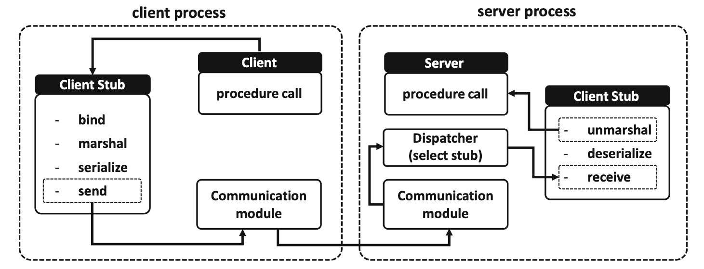

```
Fig. 5.4 Functions of remote procedure calls (adapted from Alonso et al. ( 2004 ))
```
132 5 Middleware


data type that can be used as an argument for a local procedure. Obviously, the
middleware running on the client and the server side must use the same message
format and encoding; there must be agreement about the protocol.
Implementation of the underlying communication is based on lower-level pro-
gramming abstractions, such as sockets. This means that, before calling a remote
procedure, a client must know the server’s address before initiating a connection.
Similarly, the server has to bind a socket to a specified address and port. This process
is referred to as binding: Before making calls, the client has to be bound to the server.
There are two different ways to do this: (1) static and (2) dynamic binding. The
simplest way is to use static binding: The developer can start the client with the
specific server address or even hardcode the server address (and port) into the client
at compile time. The advantage is that a call can be made directly without any
overhead or need to search for the server. However, it requires that the developers
reconfigure or even recompile the client whenever the server is relocated. Load
balancing and an automated failover mechanism that can compensate for the crash of
a server are impossible in the case of static binding. By contrast, dynamic binding
schemes locate the server at runtime before making a call. This requires an additional
lookup service, which allows the server to register under some name and which can
then be used by the client tofind the address and port of the server. This allows
developers to decouple the (symbolic) name from the (location-dependent) address,
which is similar to using domain names instead of physical hardware addresses on
the Web (see Chapter 4 ). Using dynamic binding schemes facilitates load balancing
and the operation of a failover mechanism but requires an additional service and
imposes a comparably small overhead for the lookup.

## 5.3 Middleware Categories

Literature provides several categorizations and descriptions of middleware (Alonso
et al. 2004 ; Curry 2005 ; Bernstein 1996 ; Mahmoud 2005 ). These different categories
result from the historical development of middleware and its ongoing improvement
in commercial implementation. This chapter sorts middleware into three main
categories. Thefirst subchapter shows the functionalities and some commercial
implementations of message-oriented middleware infrastructures. The next
subchapter shows the aspects of transaction-oriented middleware and the well-
known implementation of the transaction processing (TP) monitor. The last
subchapter defines the characteristics of object-oriented middleware and the
established CORBA architecture.

## 5.3.1 Message-Oriented Middleware

MOM refers to middleware based on synchronous or asynchronous communication,
namely, the transmission of messages. A MOM system client can send messages to

5.3 Middleware Categories 133


and receive messages from other clients of the messaging system. The format for
MOM messages is notfixed, but XML (see chapter 6 ) has become a popular format.
Each client connects to one or more servers that act as intermediaries in the sending
and receiving of messages.

```
Message-Oriented Middleware
Message-oriented middleware (MOM) is any middleware infrastructure that
provides messaging capabilities. It provides a means to build distributed
systems, where distributed processes communicate through messages
exchanged via message queuing or message passing (Curry 2005 ; Bouchenak
and de Palma 2009 ).
```
MOM uses a peer-to-peer relationship between individual clients; each peer can
send messages to and receive messages from other client peers. MOM platforms
facilitate the creation offlexible cohesive systems; a cohesive system is one that allows
changes in one part of a system to occur without the need for changes in other parts of
the system (Curry 2005 ). XML is widely used as the basic language for messages in
MOM. Owing to the comparatively self-explanatory and (unlike binary format mes-
sages) easily human-readable format, it is relatively easy to use XML to enable
communication between middleware systems if they use different languages, as
long as the languages are XML-based. To enable communication, an XSLT processor
(XML is discussed in depth in Chapter 6 ) can be used as an intermediary translator to
translate messages from the source system’s XML-based language to the target
system’s language by means of a transformation style sheet. SOAP (see Chapter 6 )
is often used as the protocol. The idea of MOM was not new but was often presented as
a revolutionary technique that could be a game changer in the context of developing
distributed systems. Some RPC implementations already offer a way to carry out
asynchronous interactions, and some TP monitors (see chapter5.3.2) contain message
queues to handle message-based interactions (Alonso et al. 2004 ).

Message Passing vs. Message Queuing
Message passing refers to transient communication between two processes that are
active at the same time. In other words, the receiver needs to be ready to receive a
message when the sender sends the message. For example, asynchronous RPC is
based on a (transient) passing of the request message.‘Asynchronous’indicates that
the client does not wait for a response.
The message queuing model requires an additional intermediary component,
which is called the message queue (essentially a mailbox independent of the receiver).
The message queue stores messages and, thus, temporally decouples sender and
receiver. The use of persistent storage for the buffering of messages makes it possible
to extend a message’s lifetime beyond the lifetime of the message queue process.
Thus, messages can still be used even in the event of a message queue failure.
The differences between message passing and message queuing are illustrated in
Fig.5.5. The times when processes are active (i.e., when they are ready to send

134 5 Middleware


and/or receive messages) are depicted on the time axis as a bold line. In the message
passing example on the left, the rendezvous time–that is, the time during which both
processes are active and can exchange messages–is visually indicated by the gray
area. In the message queuing example on the right, there is no need for such a
rendezvous time because of the intermediate message queue. This allows processes
to communicate even though they are not active at the same time. A simple analogy
of this is two basketball players passing a ball to each other without the ball touching
the ground. However, the message queuing model would allow one player to place
the ball on the ground and leave it there for another player to pick up (either
immediately or later). Some forms of MOM offer publish/subscribe communication
as an alternative form of message queuing and message passing. Publish/subscribe is
a model of network programming in which a message sender does not explicitly
specify the receiver’s address (Uramoto and Maruyama 1999 ).

Message Broker
Any MOM that handles messages to route them to the specific recipient uses a
message broker as a building block (Clark et al. 2002 ). The MOM provides basic
communication among the applications and features, including message persistence
and guaranteed delivery. A message broker is an intermediary process that imple-
ments message queues. Fig.5.6shows the function of a message broker. Both the
sender and the receiver of a message only need to directly exchange messages with
the intermediary broker. This message broker can run on a central machine, there can
be a system of federated message brokers, or it can even be outsourced to a cloud
computing provider. The sender can issue an enqueue request, which means the
broker stores a message in a given message queue (see Fig.5.6). When the recipient
is ready to receive the next message from a given queue, it sends a dequeue request.
In turn, the message broker will return the message and delete it from the queue.
Necessarily, the communication between sender and broker–and between receiver
and broker–is implemented based on message passing.

```
sender receiver
```
```
send
```
```
send
```
```
sender receiver
enqueue
```
```
enqueue
```
```
dequeue
```
```
dequeue
```
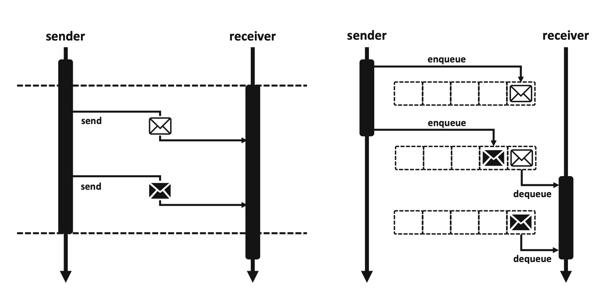
```
Fig. 5.5Message passing vs. message queuing
```
5.3 Middleware Categories 135


When distributed systems are designed, implementing a message broker offers a
number of additional benefits. First, the client (or sender) does not need to be aware
which system the server (or receiver) is running. It just sends messages to the
message broker, which adds the message to a particular queue instead of sending
it directly to the server (or receiver). So, in a message broker implementation
environment, the sender focuses on the message’s semantics rather than who the
recipient is. Second, the receiver can change its location during the runtime without
affecting the client. This means the location dependency between a client and a
server is reduced. It can also be transparently changed to multicast or broadcast
messages: The message broker can decide not to delete the message from the queue
after thefirst dequeue operation and could, instead, decide that a certain group of
recipients should receive it. This simplifies the scalability significantly because there
could be multiple servers (labeled as receivers in Fig.5.7) without the client even
being aware of it.

```
sender broker receiver
```

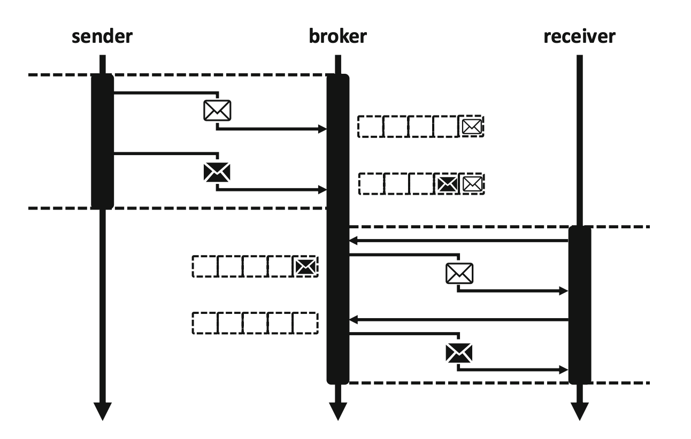

```
Fig. 5.6Message queuing with a message broker
```
136 5 Middleware


Publish/Subscribe
As mentioned above in thefirst section, a MOM could offer publish/subscribe
communication instead of message queuing or message passing. This special case
of message queuing is called publish/subscribe message-oriented middleware
(PSMOM) (Wang et al. 2011 ; Albano et al. 2014 ). A PSMOM’s messages are
events‘published’to recipients who have‘subscribed’to receive them (Albano
et al. 2014 ). Publish/subscribe is a messaging pattern that categorizes published
messages into classes without the subscribers’knowledge (Belokosztolszki et al.
2003 ). Similarly, subscribers express interest in one or more classes and only receive
events that match these classes without having any knowledge of the senders
(Eugster et al. 2003 ). PSMOMs can be topic-based, content-based, or data-based.
In a topic-based system, the subscribers can receive events based on individual
topics, which are described by keywords. In this interaction paradigm, the topic is
the message queue, and each topic builds its own queue (Albano et al. 2014 ). The
content-based system enhances the topic-based approach by introducing a subscrip-
tion scheme based on the content (Cugola and Jacobsen 2002 ; Shen 2010 ). The data-
based approach is an advanced version of the topic-based approach in which the data
structures are shared among peers (senders and subscribers). Sharing the data
structures enables the peers to receive only the changed data. If a new peer sub-
scribes to these events, only thefinal status of the data will be sent instead of all the
events regarding the requested topic (Albano et al. 2014 ).

Messaging Protocols
When MOMfirst became popular, a lack of standards limited the interoperability
between different MOM implementations. Today, in order to reduce technological
dependence on the implementation, language, and platform, MOM uses standard-
ized APIs and protocols. Standards like Java Messaging Service (JMS), Advanced

```
sender receiver receiver
```
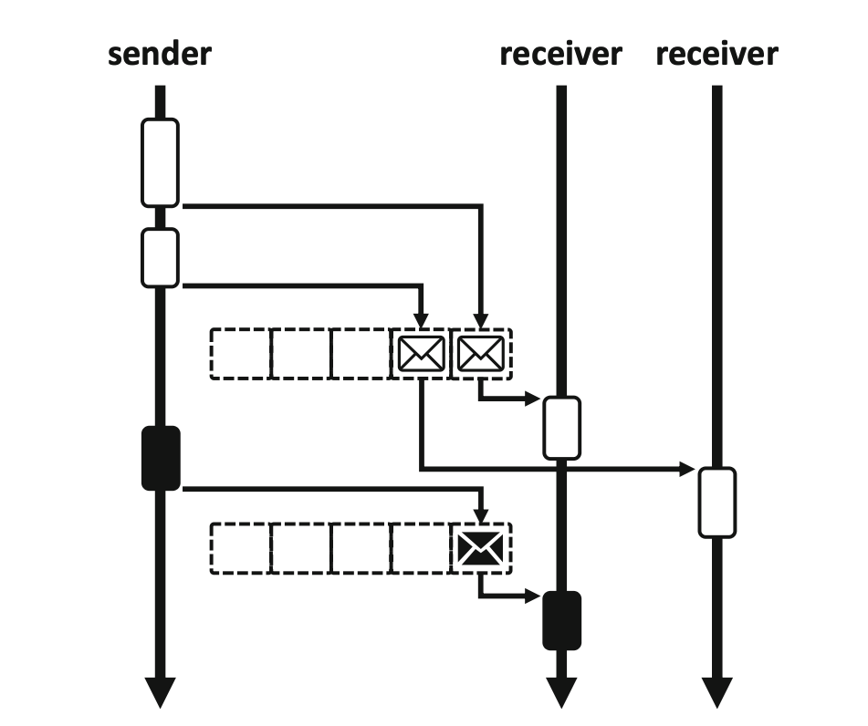
```
Fig. 5.7Multiple receivers in a message broker scenario
```
5.3 Middleware Categories 137


Message Queuing Protocol (AMQP), and Data Distribution Service by the Object
Management Group (OMG DDS) now enhance the interoperability of MOM
implementations. JMS is part of the Java Platform Enterprise Edition (Java EE)
and was defined by a Sun Microsystems specification. The specification of the
service and the associated API has been standardized by the Java Community
Process within the framework of JSR 914 (Hapner 2002 ). It is a messaging standard
that allows applications based on Java EE to create, send, receive, and read messages
from MOM (Curry 2005 ). Owing to JMS’s widespread use, all of its functions have
been incorporated into the JSR 914 framework or current MOM standard. This
allows developers to continue using the JMS interface, while MOMs can commu-
nicate with each other by means of AMQP (OASIS 2019 ). OMG DDS was devel-
oped by the Object Management Group. It is a comprehensive standard that includes
a standardized API and a set of standardized protocols. It is based on the publisher/
subscriber concept, which supports deterministic resource management. The speci-
fication is divided into two areas: Data-Centric Publish/Subscribe (DCPS), which
describes the basic concepts for data distribution, and Data Local Reconstruction
Layer (DLRL), which provides an abstraction layer for applications based on DCPS
(Object Management Group Inc. 2019 ).

Implementations of MOM
Some examples of commercial implementations of MOM are Message Queuing
(MSMQ) (Microsoft 2016 ), Apache ActiveMQ (Apache Software Foundation
2019 ), Amazon Simple Queue Service (SQS) (Amazon Web Services 2019 ), IBM
WebSphere MQ (IBM 2019 ), and Rabbit MQ (Pivotal Software 2019 ). MSMQ is an
application protocol developed by Microsoft that provides message queues. On
Windows, it is deployed by the Microsoft Message Queue Server (Microsoft
2016 ). Apache ActiveMQ is a free message broker that fully implements Java
Message Service 1.1 (JMS). Apache ActiveMQ changes the connections of a
network between existing applications by converting synchronous communication
between applications to be integrated into asynchronous communication (Apache
Software Foundation 2019 ). Amazon SQS was introduced byAmazon.comin late

2004. It supports the programmatic sending of messages via Web service applica-
tions to communicate over the Internet. SQS is intended to provide a highly scalable
hosted message queue that resolves issues arising from the common producer–
consumer problem or connectivity between producer and consumer (Amazon Web
Services 2019 ). IBM WebSphere MQ is a platform-independent MOM. It was
introduced in 1992 and is based on the principle of message queuing. By default,
it offers OAM (object authority manager) and secure sockets layer (SSL) security for
communication (IBM 2019 ). RabbitMQ is an open-source MOM that implements
the Advanced Message Queuing Protocol (AMQP) and essentially falls under the
control of VMWare. It has been extended with plug-in architecture to support the
Streaming Text-Oriented Messaging Protocol (STOMP), and Message Queuing
Telemetry Transport (MQTT). The RabbitMQ server is written in the Erlang pro-
gramming language. The Open Telecom Platform (Pivotal Software 2019 ) serves as
the foundation for clustering and failover mechanisms. The main differences

138 5 Middleware


between these implementations of MOM are different programming languages,
different levels of scalability, varying kinds of administration functions, and several
backup functions.

## 5.3.2 Transaction-Oriented Middleware

Transaction-oriented middleware (TOM) supports synchronous and asynchronous
communication among heterogeneous hosts and facilitates integration between
servers and database management systems (Capra et al. 2001 ). TOM is often used
with distributed database applications.

```
Transaction-Oriented Middleware
TOM is any middleware infrastructure that supports the execution of elec-
tronic transactions in a distributed setting (Alonso 2018 ).
```
The following subchapter explains the concept of TOM, including one of the
oldest and best-known types of TOM: the TP monitor. The subsequent subchapter
describes many of the TP monitor’s functionalities and aspects. Historically, the TP
monitor has grounded TOM, which runs on mainframes to provide functionalities
that are not offered by the operating system (Alonso 2018 ).

Concept of Transaction-Oriented Middleware
TOM enables developers to define the services offered by server components. The
client applications that they develop can request several of those services that are
offered on the server component. The client and server components can be
implemented on different hosts because the transaction can be transported via the
network. The way in which the transactions are transported is transparent to both the
client and the server components. In addition, the client component’s requests can be
either synchronous or asynchronous. TOM supports various activation policies. The
service can be permanently active or active on demand, and if a service has been idle
for too long, it can be deactivated (Capra et al. 2001 ).
TOM guarantees the atomicity property of a transaction as long as the participat-
ing systems implement the two-phase-commit protocol (see Fig.5.8). In thefirst
phase of the standardized two-phase commit, a coordinator (usually the process that
initiates the committing) obtains approval or denial to commit the data changes of all
the processes involved (also called the‘Prepare Phase’). Only then, if all participants
agree, does the coordinator decide to‘Commit’; otherwise, there is a‘Rollback’of
the decision. If the decision has been made, the coordinator informs the participants
of the result in the second phase (‘Commit Phase’) of the protocol.

5.3 Middleware Categories 139


According to this common result, either the entire transaction is reset or all partial
transactions are brought to a successful conclusion by releasing the resources that
have been blocked in the process (Bernstein et al. 1995 ). In addition to these
functionalities, most TOM implementations offer a load balancing and replication
of server components (Balasubramanian et al. 2004 ).
TOM implementations are still a key component of many enterprises’computing
solutions and are mainly used in the context of high-performance processing, for
example, in the context offinancial services such as online trading. They are also
used in application servers–for example, online shops or multitier systems–to
support the execution of transactions like purchases (Alonso 2018 ).

ACID Transactions
To support transactions, TOM has to use existing transaction-processing concepts
like ACID. ACID, which stands for atomicity, consistency, isolation, and durability,
is a set of properties for transactions that are sometimes called classical transactions
orflat transactions (Mahmoud 2005 ). They are a prerequisite for system reliability.
This acronym was coined in 1983 by computer scientists Theo Härder and Andreas
Reuter (Haerder and Reuter 1983 ).
In the context of TOM, a transaction is a series of database operations that are
executed either in full or not at all. They are also known as all or nothing affairs
(Mahmoud 2005 ). In practice, the individual database statements for the transactions
are executed sequentially. These database statements are not validated and put into
effect before they have been successfully completed. If the transaction cannot be
completed during the process, the origin area is declared valid and a rollback is
performed. This means that all previously executed statements are reversed if
necessary, or the database’s memory area, which is used for the changes in the
meantime, is released, and the validity is left at the previous statement. The
two-phase commit (see Fig.5.8) and the DO-UNDO-REDO protocol form the

```
Request-to-Prepare
```
```
Prepared
```
```
Commit
```
```
Done
```
```
Prepare
Phase
```
```
Commit
Phase
```
```
TransacƟon
Coordinator
```
```
Resource
Managers
```
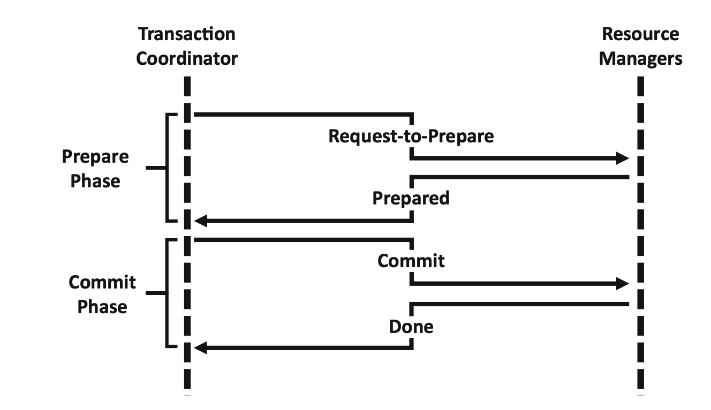
```
Fig. 5.8Two-phase commit
```
140 5 Middleware


basis for achieving atomicity in many TOMs. The DO-UNDO-REDO protocol is
used to roll back or roll forward transactions with the help of transaction log entries.
Atomicity guarantees that each transaction is treated as a single‘unit’that either
succeeds or fails in its entirety. Consequently, transactions should be designed as do,
undo, and redo functions, where the do function produces a log record that can be
used in the case of an error during the transaction to undo or redo this transaction
(Gray 1981 ). Consistency means that a transaction leaves a consistent database state
after completion if the database was consistent before. This implies that all integrity
conditions defined in the database schema are checked before the transaction is
completed (Cattell 2011 ). The property of isolation states that transactions should be
designed in such a way that they prevent transactions that are executed in parallel
from influencing each other. This is usually achieved by locking procedures that
obstruct the required data for other transactions before data are accessed. Locking
procedures limit concurrency and can lead to blocking. In many database systems,
the isolation method that is used can be configured to achieve greater concurrency.
The most common problem is the‘lost update’anomaly, in which two transactions
read and update the same object at the same time. This can lead to data being
overwritten by the second transaction, causing the data of thefirst transaction to be
lost. The transactional isolation level defines the permitted type of influence
(Mahmoud 2005 ). Property durability means there is a guarantee that the data will
be permanently stored in the database after a transaction has been completed
successfully. The permanent storage of the data must also be guaranteed after a
system error. In particular, data must not be lost if the main memory fails. Durability
is ensured by the DO-UNDO-REDO protocol, writing a transaction log (write-ahead
log protocol), and enforcing the‘force-at-commit’rule. The combination of these
protocols and rules allows the user to reproduce all missing write operations in the
database after a system failure.
The‘write-ahead log’(WAL) protocol is a database technology procedure that
helps to ensure transactions’atomicity and durability. It states that modifications
must be logged before they are actually written. It enables an‘update-in-place,’
which means that the old version of a data record is overwritten by the new version at
the same location (Haerder and Reuter 1983 ). According to the‘force-at-commit’
rule, a transaction should not be committed until the after-Images/images of all its update
parts are in stable storage (in this case, in the log or the database) (Bernstein and
Newcomer 2009 ).

Transaction Processing Monitor
The transaction processing (TP) monitor is one of the oldest and best-known types of
TOM. Initially, TP monitors were developed as multithreaded servers to support
large numbers of terminals from a single process. The TP monitor is also the most
reliable, most stable, and best-tested technology in the enterprise application inte-
gration context (Alonso et al. 2004 ). TP monitors are not developed for general
program-to-program communication integration but provide solutions for
transaction-type applications that utilize a database (Khosrowpour 2002 ). IBM’s
Customer Information and Control Systems (CICS) was one of the earliest TP

5.3 Middleware Categories 141


monitor implementations, and it was the first commercial product offering
transaction-protected distributed computing (Gray and Reuter 1992 ). It was built at
the end of the 1960s and is still in use today (e.g., in banking transactions) (Alonso
et al. 2004 ).
For many decades, the TP monitor completely dominated the middleware market.
It is one of the most successful forms of middleware and makes it possible for many
operations in our everyday lives, such as purchasing a plane ticket by connecting
several airline systems, to deliver good performance and be reliable. TP monitors can
still be found in most application servers and Web services implementations today
(Alonso et al. 2004 ). Besides CICS, there are many commercially offered
implementations, including Microsoft Transaction Server (MTS) and Oracle Tux-
edo, which was developed by AT&T in the 1980s. MTS is based on proven
transaction processing methods. MTS comprises a simple programming model and
execution environment for distributed component-based server applications
(Limprecht 1997 ). Tuxedo (Transactions for Unix, Extended for Distributed Oper-
ations) is a transaction processing system, transaction-oriented middleware, or
enterprise application server for a variety of systems and programming languages
(Bernstein and Newcomer 2009 ).
The TP monitor’s main function is to coordinate theflow of requests between
terminals or other devices and application programs that can process these requests
(Fig.5.9). A request is a message that asks the system to execute a transaction.
Transactions can be processed in parallel by several TP monitors or TP monitor
processes (performance and scaling). The application that executes the transaction
usually accesses resource managers, such as database and communications systems.
A typical TP monitor instantiation includes functions for transaction management,
queuing, routing, and messaging and supports the distribution of applications.
Many TP monitors also provide locking, logging, and recovery services to enable
application servers to implement ACID (see the section above) properties by
themselves. Transaction management involves support for operations that start,
commit, and abort a transaction. It also provides interfaces to resource managers
(e.g., database systems) that are accessed by a transaction so that a resource
manager can tell the transaction manager when it is accessed by a transaction,
and the transaction manager can tell resource managers when the transaction has
committed or aborted. A transaction manager implements the two-phase commit
protocol. This protocol ensures that all or none of the resource managers commits
are executed. The queuing function of the TP monitor enables the persistent storage
of data to move between transactions. A distributed queue manager can be invoked
remotely and may provide the system management operations required to forward
elements from one queue to another (Bernstein 1996 ). Distributed queuing means
sending messages from one queue manager to another. A queue manager handles
all incoming messages. The routing function ensures that messages from the client
side are sent to the servers by using TP monitors (Chorafas 1998 ), and the messages
are coordinated by TP monitors and handled via the queuing function mentioned
above (Ray 2009 ).

142 5 Middleware


By integrating different services, the TP monitor offers a simplified and uniform
API. One way to simplify the API is to maintain the context and thereby prevent
certain parameters from being passed on. For instance, a TP monitor generally
maintains the context of the actual request, transaction, and user. Most of the
application functions do not have to specify this information. Rather, the TP monitor
completes the necessary parameters when it converts an application call to a call on
the underlying middleware. For instance, an application may request that a message
be queued, and the TP monitor will add the current transaction ID and the user ID as
parameters. A TP monitor can customize the user interface. For instance, it can have
a stylized interface that displays errors and menus and makes it possible to log in. A
TP monitor has application development tools, including a data dictionary for
sharing record definitions between form managers, application programs, and data-
bases. A TP monitor also has system management tools that display the state of a
transaction or determine which components are currently unavailable. System man-
agement can be deployed in its own framework, which combines the TP monitor
with the platform and database system so that all resources can be managed in the
same way from the same device. Most clients buy a complete TP system from a
vendor, including a TP monitor, database system, and platform (Alonso et al. 2004 ).

```
Registered
programms
```
```
interface (API,
presentaƟon,
authenƟcaƟon)
```
```
client
applicaƟon
```
```
communicaƟon
Manager
```
```
program flow router
```
```
TransacƟon management
```
```
Resources
```
```
TP services
```
```
wrapper
```
```
wrapper
```
```
wrapper
```
```
Resource
```
```
Resource
```
```
Resource
```
```
TP monitor
```
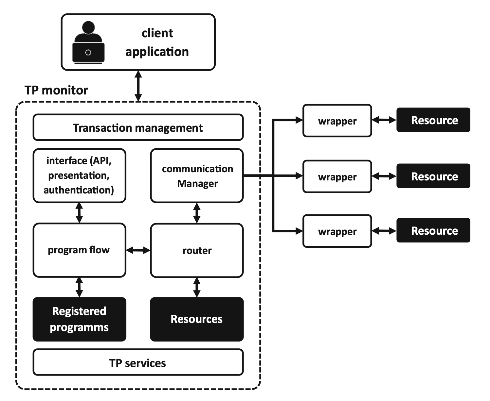
```
Fig. 5.9 Components of a TP monitor (adapted from Alonso et al. ( 2004 ))
```
5.3 Middleware Categories 143


TP-Lite and TP-Heavy Monitors
In the context of TP monitors, making a distinction between TP-lite and TP-heavy
monitors is a common way to describe different implementations (Gray 1993 ).
When the TP monitor implementation is integrated in a database system, it is called
a TP-lite monitor. The stored procedure is invoked and executed according to the
ACID properties. In contrast to the TP-lite monitor, the TP-heavy monitor imple-
mentation supports the client-server architecture and allows the user to initiate very
complex transactions (Gray and Reuter 1992 ). They act as a standalone product for
the development of distributed applications that require high performance (Alonso
2018 ). TP-heavy monitors offer flexibility by using standardized transaction
protocols.
The two kinds of monitors both have advantages and disadvantages. For example,
if the data are stored in multiple databases, a TP-lite solution is not appropriate
because it does not support complex transactions (Umar 2004 ). If the data synchro-
nization interval is periodic, a TP-lite monitor is better than a TP-heavy solution. In
general, small applications are more likely to use a TP-lite monitor (Umar 2004 ).
One commercial implementation of TP-heavy and TP-lite monitors can be found in
Oracle RDBMS. Oracle Tuxedo Oracle RDBMS is a database management system
software owned by Oracle and offers a TP-lite monitor functionality, while Oracle
Tuxedo offers a TP-heavy monitor (Oracle2019a).

Transactional RPC
TP monitor implementations can be considered an extension of the RPC concept.
They handle remote procedure calls in a transaction with the inherent ACID prop-
erties. In particular, the ACID property of atomicity means that either all invoked
remote procedure calls are processed or none of them are. Thus, TP monitors
implement an abstraction of RPC, called transactional RPC (TRPC). In TRPC, a
group of procedure calls is provided with the transactional brackets beginning of
transaction (BOT) and end of transaction (EOT) and treated as a unit. This is the task
of the transaction management module, which controls the interactions between
clients and servers and ensures their atomicity by implementing the two-phase-
commit protocol (Alonso et al. 2004 ).

## 5.3.3 Object-Oriented Middleware

Object-oriented middleware (OOM) is based on the RPC mechanism. This subsec-
tion provides a general definition of OOM and introduces CORBA, which is the
best-known OOM standard. In the literature, the OOM concept is not clearly defined
and is sometimes also referred to as request broker, object broker, object request
broker, or distributed object middleware (Gokhale 2009 ; Mahmoud 2005 ; Alonso
et al. 2004 ). These terms are sometimes used interchangeably but can also describe
distinct or related OOM concepts.

144 5 Middleware


```
Object-Oriented Middleware
OOM is defined as a middleware infrastructure that offers object-oriented
principles for the development of distributed systems (Capra et al. 2001 ).
```
Concept of Object-Oriented Middleware
OOM enables communication between objects within a distributed system (e.g., the
Internet) and is independent of both the operating system and the programming
language. In short, OOM infrastructures support interoperability among objects and
provide location transparency through RPC (Birrell and Nelson 1984 ). The idea of
OOM is to make the principles of object-oriented programming, such as object
identification through references and inheritance, available for the development of
distributed systems. OOM supports distributed object requests from clients, which
means that a client can initiate the operation of a server object that may reside on
another host. To this end, the client defines an object reference in relation to the
server object. Stubs, which are generated from interface definitions (written in IDL),
marshal the operation parameters required to execute a function on the server object
and handle the results. Every OOM uses the IDL. In addition to standard RPC, an
OOM IDL supports object types as parameters, failure handling, and inheritance.
OOM enables IDL compilers to generate client and server stubs, which implement
the session and presentation layer. OOM provides very powerful component models
that integrate the functionalities of TOM, MOM, and RPC (Capra et al. 2001 ).

Interface Definition Language
The IDL is a declarative formal language containing a language syntax to describe a
software component’s interfaces. It can be used to describe objects and the methods
applicable to them, together with the possible parameters and data types, without
using the properties of a particular programming language. The interface description
language serves purely to describe the interface but not to formulate algorithms.
Starting with the IDL, a special compiler can convert the definitions into a specific
programming language and computer architecture, which is called language binding
(Wirsing and Nivat 1996 ).

Common Object Request Broker Architecture
The Common Object Request Broker Architecture (CORBA), developed by the
OMG (Object Management Group Inc. 2012 ), is a well-established specification for
OOM. At its core is an Object Request Broker (ORB), which defines cross-platform
protocols and services. Thefirst version, CORBA 1.0, was published in August

1991. The CORBA specification is not bound to a specific platform; rather, software
manufacturers or communities are called upon to create their own object request-
broker implementations on the basis of this specification. Rather than a concrete
implementation, CORBA is an abstract specification of the different components,
services, and protocols of distributed objects middleware. CORBA-compliant
implementations simplify the creation of distributed applications in heterogeneous

5.3 Middleware Categories 145


environments (Siegel 2000 ). However, the lack of a reference implementation of this
abstract specification, as well as its complexity, has been a major point of criticism
against CORBA. Today, there are a number of mature implementations (see com-
mercial implementations at the end of this chapter). Most vendors offer
implementations for multiple programming languages and operating systems. To
this end, the common specification enables communication between applications
that have been created with different programming languages, use different ORBs,
and run on different operating systems and in distinct hardware environments. The
overall architecture of CORBA is illustrated in Fig.5.10. It shows that CORBA
provides a client-server type of communication. To request a service, a client
invokes a method implemented by a remote object, which acts as the server in the
client-server model. The line in the middle of Fig.5.10indicates the border between
the client and the server side.

### CORBA IDL

CORBA IDL, a central component of CORBA, is used to specify the interfaces of
objects in a language-neutral way. CORBA IDL builds on the IDL of earlier
implementations of RPC and OOM. Like other OOM implementations, CORBA
comes with an IDL compiler that automatically generates the client stub and the
server skeleton. Furthermore, CORBA defines a standard language mapping for a
number of languages like C/C++, Java, C#, Lisp, Smalltalk, Ada, Python, and
Objective-C (Baker 1997 ), which makes it possible to share objects between a
number of different programming languages and platforms and makes CORBA an
important platform for the development of an assortment of distributed applications
(see Fig.5.11). CORBA also contains components that facilitate the integration of
legacy components (e.g., servers implemented using RPC middleware) (Vinoski
1993 ).

```
TCP socket
```
```
ORB ORB
```
```
ORB(s) (orbixd)
& implementaƟon
respository
```
```
client stub
(proxy)
```
```
CORBA
library
```
```
Client Server
```
```
Object skeleton
object adaptor (CORBA lib)
```
```
Object
```
```
Client Machine Server Machine
```
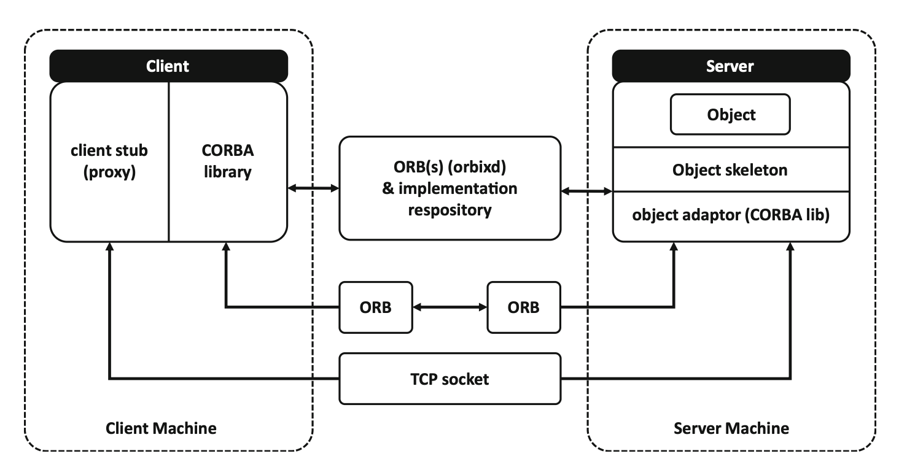
```
Fig. 5.10CORBA overall architecture (adapted from Emerald et al. ( 1998 ))
```
146 5 Middleware


CORBA APIs and protocols
CORBA ensures the portability of client and server code between ORB
implementations via a set of standardized programming interfaces (Maffeis and
Schmidt 1997 ). The typical RPC development model assumes that an interface
description is used to generate a client stub and a server skeleton during develop-
ment. However, there are also scenarios in which a client discovers a service at
runtime. For this purpose, CORBA contains the Dynamic Invocation Interface (DII),
which allows clients to programmatically discover objects and invoke methods
without a client stub. In this case, there is no location transparency: The client
explicitly constructs and generates CORBA invocations via the DII rather than
calling a stub method. The Dynamic Skeleton Interface (DSI) is the server-side
counterpart; it can be used to provide services at runtime without a server skeleton
(Gokhale and Schmidt 1996 ). The object adapter is the interface used by the servant
object– for instance, to register the implementation, count references, create
instances, etc. The Basic Object Adapter contains interfaces specific to the relevant
ORB implementation. This means that the server-side code is not portable between
different CORBA implementations. For this reason, CORBA introduced the Porta-
ble Object Adapter (POA), a specification that standardizes the interfaces used by the
object implementation. The term‘servant’was introduced for this implementation.
The separation between object and implementation allows for veryfine control of
access on the server side, which is completely invisible to the client. Thus, servants
using the POA are portable between different ORB implementations (Pyarali and
Schmidt 1998 ). Standardized APIs ensure that the client- and the server-side codes
of a distributed application are portable across different ORBs. CORBA needs to
ensure that a client running on ORB can invoke a server running on another ORB.
Accordingly, the communication protocol between ORBs (i.e., how method invo-
cations, arguments, and return values are marshaled and what message format is

```
Std. language
mapping
```
```
Interface Repository IDL Compiler ImplementaƟon Repository
```
```
Client OBJ REF OperaƟon Object (Servant)
```
```
in args
```
```
out args + return value
```
```
stubsIDL DII DSI
```
```
IDL
skeleton
```
```
object
adapter
```
```
ORB
interface
```
```
ORB CORE GIOP / IIOP / ESIOPS
ORB – specific Interface
```
```
Std. Interface Std. Interface Std. language
mapping
Std. Interface Std. Interface
```
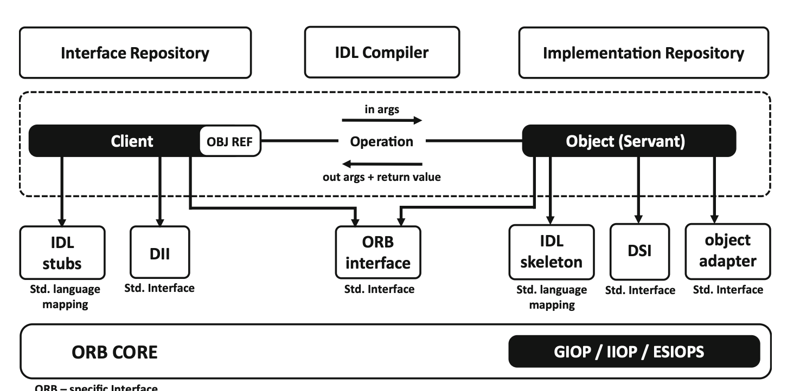
```
Fig. 5.11 CORBA components
```
5.3 Middleware Categories 147


being used) needs to be standardized. This specification is split into an abstract and a
concrete part. The General Inter-ORB Protocol (GIOP) is an abstract specification
that contains, among others, details of how to map IDL data types to the wire format.
It further describes the format of messages involved in an invocation, how connec-
tions are managed, etc. (Vinoski 1997 ). Internet Inter-ORB Protocol (IIOP) and
Environment-Specific Inter-ORB Protocols (ESIOPS) are two of the protocols used
in the context of CORBA, and they are based on GIOP.
CORBA evolved at a time when distributed applications were running mainly on
local networks. It was originally not designed for communication over the Internet,
and using GIOP over the Internet can be challenging because offirewalls (Gokhale
and Schmidt 1998 ). For this reason, some implementations have added protocols
that allow ORBs to communicate via HTTP (Object Computing 2019 ). However,
this is not part of the CORBA standard.

Implementation
CORBA is implemented in several different solutions, including The ACE ORB
(TAO) from Object Computing Inc. (Object Computing 2019 ), VisiBroker from
Micro Focus International plc (Micro Focus International plc2019b), and ORBacus,
which is also from Micro Focus International plc (Micro Focus International plc
2019a). TAO is a free, open-source, standard-compatible, real-time implementation
of CORBA in C++ based on the ACE framework.
TAO offers a scalable quality of service (QoS) for the entire communication path
(from end to end). Unlike conventional implementations of CORBA, TAO applies
software practices and patterns to simplify the automation of high-performance real-
time QoS for distributed applications (Object Computing 2019 ). The Java-based
VisiBroker can be deployed in any Java environment. It offers support for the C++
programming language, object naming, persistent objects, dynamic object creation,
and interoperability with other ORB implementations and has the ability to distribute
objects across a network (Micro Focus International plc2019b). ORBacus is a
CORBA-compliant middleware that is used on mission-critical systems in the
telecommunication,financial, government, defense, aerospace, and transportation
industries. ORBacus conforms to CORBA 2.6, is designed for rapid development
and deployment, and supports C++ and Java (Micro Focus International plc2019a).

Commercial Implementations–Component Object Model
The Component Object Model (COM) is a technique developed by Microsoft for
inter-process communication in Windows. COM components can be implemented
as runtime modules (DLLs) or executable programs. COM is supposed to enable the
easy reuse of already written program code, partly also outside the operating system.
COM components can be used independently of the programming language (Goos
et al. 2001 ). Microsoft introduced COM in 1992 with the Windows 3.1 graphical
user interface. COM is based on the client–server model. A COM client generates a
COM component in a COM server and uses the object’s functionality via COM
interfaces. Access to objects is synchronized within a process by COM apartments.
Many functions of the‘Windows Platform SDK’are accessible via COM. COM is
the basis on which‘Object Linking and Embedding’(OLE) automation and ActiveX

148 5 Middleware


are built. OLE is a low-level, object-oriented technology based on the Component
Object Model (COM); it provides services to applications for creating compound
documents. ActiveX is a Microsoft software component model for active content.
However, with the introduction of its .NET software framework, Microsoft pursued
the strategy of replacing COM in Windows with this framework, which it called.
NET Remoting. .NET Remoting is built into the Common Language Runtime
(CLR), which provides uniform interfaces to other technologies in .NET. Microsoft
now considers .NET Remoting an obsolete technology, and it is no longer
recommended for the development of distributed applications. The recommended
successor technology is the Windows Communication Foundation (WCF), which is
also part of .NET.

Commercial Implementations–Windows Communication Foundation
The WCF (formerly codenamed Indigo) is a service-oriented communication plat-
form for distributed applications in Windows. It combines many network functions
and makes them available to the developers of such applications in a standardized
way. The WCF combines the DCOM, Enterprise Services, MSMQ, WSE, and Web
Services communication technologies in a uniform programming interface
(Microsoft 2017 ). The WCF replaces .NET Remoting and can be used in the
development of service-oriented architectures. It also enables interoperability with
Java Web Services, which have been implemented using Web Services Interopera-
bility Technology (Microsoft 2017 ).

Commercial Implementations–Distributed Component Object Model
The Distributed Component Object Model (DCOM) is an object-oriented remote
procedure call system based on the Distributed Computing Environment standard. It
was developed by Microsoft to let the Component Object Model software commu-
nicate over a computer network. It was formerly known as Network OLE. These two
names indicate the origin of the protocol. It expands the earlier interface definitions,
Component Object Model and Object Linking and Embedding, to include networks.
DCOM was developed by Microsoft, which is the model’s primary user (e.g., with
ActiveX) (Microsoft 2018 ). However, there are also different adapters that make it
possible to communicate via a DCOM protocol without directly using Microsoft’s
DCOM implementation. One example is JCOM, which creates an interface between
Java and DCOM (Marin 2003 ).

Commercial Implementations–Remote Method Invocation
RMI is the call to a method of a remote Java object and implements the Java-specific
nature of RPC (Oracle2019b). Here,‘remote’means the object (and its methods)
can be located in another Java virtual machine, which, in turn, can run on a remote
computer or on a local computer. The execution of the calling object (or its pro-
grammer) looks exactly like a local call, but special exceptions must be handled,
such as a terminated connection to a remote computer. On the client side, the stub
takes care of the network transport. Before the release of version 1.5.0 of the Java
2 Standard Edition (J2SE), the stub was a class created with the RMI compiler rmic.
The stub is created by the Java Virtual Machine. Remote objects can also be

5.3 Middleware Categories 149


provided by a remote object already known in the program, but for thefirst
connection, the address of the server and an identifier (an RMI URL) are required.
For the identifier, a name service on the server returns a reference to the remote
object. For this to work, the remote object must have previously been registered with
the name service on the server under this name. Since version 1.1 of the JDK, TCP/
IP-based sockets can be extended with user-defined protocols. The classjava.netalso
supports connections based on BSD sockets (Berkeley Software Distribution). This
kind of communication has to be regarded as low-level programming. In addition to
a persistence mechanism (serialization), which secures objects and their instances, a
remote method layer has been added in order to allow–in line with high-level
programming–development at the object or the component level, regardless of the
communication on which it is based.

## Summary

The term middleware has been in use for over 50 years and the middleware concept
as a solution for linking newer applications to older legacy systems already gained
wide-spread adoption in the 1980s. Regardless of its long existence, middleware
remains highly relevant in today's IT landscape. When developing or integrating new
systems, organizations often have to rely on the unique functionality of preexisting
applications or entire systems. This chapter presented middleware as a type of
software used to manage and facilitate interactions between IT systems and appli-
cations across computing platforms.
A well-known example of middleware is the Remote Procedure Call (RPC). RPC
is the most basic type of middleware, by allowing functions to be called in other
address spaces. The invoked functions and the calling program are usually not
executed on the same computer. There are many implementations of this technique
and they tend not to be compatible with each other. From a more abstract perspec-
tive, the general idea of a procedure callfits the request–response pattern of the
client-server model. The client makes a request to some external code, sleeps, and
finds the result after control is returned to the procedure. Thus, procedure calls
constitute a natural programming abstraction for the request–response message
exchange pattern.
Literature provides several categorizations and descriptions of middleware. These
different categories result from the long evolution of middleware and its ongoing
improvement in commercial implementation. This chapter defined middleware into
three main categories. These categories are message-oriented (MOM), transaction-
oriented (TOM) and object-oriented middleware (OOM). MOM refers to
middleware based on synchronous or asynchronous communication. A MOM sys-
tem client can send messages to and receive messages from other clients through the
messaging system. TOM supports synchronous and asynchronous communication
among heterogeneous hosts and facilitates integration between servers and database
management systems. TOM is often used with distributed database applications.

150 5 Middleware


One of the oldest and best-known types of TOM is the TP monitor. TP monitors
were developed as multithreaded servers to support large numbers of terminals from
a single process. The TP monitor is also the most reliable, most stable, and best-
tested technology in the enterprise application integration context. The basic idea
behind OOM is to make the principles of object-oriented programming (e.g., object
identification through references and inheritance) available for the development of
distributed systems. OOM is based on the RPC concept and, thereby, enables
communication between objects within a distributed system (e.g., the Internet) and
is independent of both operating systems and programming languages. OOM sup-
ports interoperability between objects and provide location transparency. The most
wide-spread OOM standard is the Common Object Request Broker Architecture
(CORBA).
In addition to all its many advantages in terms of integration of heterogenous
systems and applications, middleware also bears several drawbacks. One of the
biggest drawbacks of middleware is its size and slow performance compared to
highly integrated implementations. An optimization of the performance of these
programs by the developers is rarely possible.

## Questions

1. What is location transparency in the context of RPC?
2. Explain step by step what happens when a client makes a remote procedure call.
3. How do existing middleware categories differ from each other?
4. What are the components of a TP monitor?
5. What is the difference between a local and a remote procedure call?
6. Why do we need middleware when various software components already offer
    APIs?
7. What are the most common commercial implementations of middleware?
8. What is the difference between a Web service and middleware?

## References

ACM (2017) ACM software system award.https://awards.acm.org/software-system/award-win
ners. Accessed 7 Sept 2019
Aiken B, Strassner J, Carpenter BE, Foster I, Lynch C, Mambretti J, Moore R, Teitelbaum B (2000)
RFC 2768–network policy and services: a report of a workshop on middleware.https://tools.
ietf.org/html/rfc2768. Accessed 17 Sept 2019
Albano M, Ferreira L, Pinho L, Rahman Alkhawaja A (2014) Message-oriented middleware for
smart grids. Comput Stand Interfaces 38(C):133– 143
Alonso G (2018) Transactional middleware. In: Liu L, Özsu MT (eds) Encyclopedia of database
systems. Springer, New York, NY, pp 4201– 4204

References 151


Alonso G, Casati F, Kuno H, Machiraju V (2004) Web services. In: Alonso G, Casati F, Kuno H,
Machiraju V (eds) Web services: concepts, architectures and applications. Data-centric systems
and applications, 1st edn. Springer, Berlin
Amazon Web Services (2019) Amazon simple queue service.https://aws.amazon.com/sqs/?
nc1¼h_ls. Accessed 1 Apr 2019
Apache Software Foundation (2019) Apache ActiveMQ.http://activemq.apache.org/. Accessed
1 Apr 2019
Baker S (1997) CORBA distributed objects: using Orbix, vol 7. Addison-Wesley, New York, NY
Balasubramanian J, Schmidt DC, Dowdy L, Othman O (2004) Evaluating the performance of
middleware load balancing strategies. Paper presented at the 8th IEEE international enterprise
distributed object computing conference, Monterey, CA, 24 Sept 2004
Belokosztolszki A, Eyers DM, Pietzuch PR, Bacon J, Moody K (2003) Role-based access control
for publish/subscribe middleware architectures. Paper presented at the 2nd international work-
shop on distributed event-based systems, San Diego, CA, 8 June 2003
Bernstein PA (1996) Middleware: a model for distributed system services. Commun ACM 39
(2):86– 98
Bernstein PA, Newcomer E (2009) Principles of transaction processing, 2nd edn. Morgan
Kaufmann, San Francisco, CA
Bernstein PA, Goodman N, Hadzilacos V (1995) Concurrency control and recovery in database
systems. Addison-Wesley, Boston, MA
Birrell AD, Nelson BJ (1984) Implementing remote procedure calls. ACM Trans Comput Syst 2
(1):39– 59
Bouchenak S, de Palma N (2009) Message queuing systems. In: Liu L, Özsu MT (eds) Encyclo-
pedia of database systems. Springer, Boston, MA, pp 1716– 1717
Capra L, Emmerich W, Mascolo C (2001) Middleware for mobile computing: awareness
vs. transparency. Paper presented at the 8th workshop on hot topics in operating systems,
Elmau, 20–22 May 2001
Cattell R (2011) Scalable SQL and NoSQL data stores. SIGMOD Rec 39(4):12– 27
Chorafas DN (1998) Functions of transaction processing monitors. In: Chorafas DN
(ed) Transaction management: managing complex transactions and sharing distributed data-
bases. Palgrave Macmillan, London, pp 111– 131
Clark M, Fletcher P, Hanson JJ, Irani R, Waterhouse M, Thelin J (2002) Web services business
strategies and architectures. Apress, Berkeley, CA
Cugola G, Jacobsen H-A (2002) Using publish/subscribe middleware for mobile systems.
SIGMOBILE Mob Comput Commun Rev 6(4):25– 33
Curry E (2005) Message-oriented middleware. In: Mahmoud Q (ed) Middleware for communica-
tions. Wiley, Chichester, pp 1– 29
Czaja L (2018) Remote procedure call. In: Czaja L (ed) Introduction to distributed computer
systems: principles and features. Lecture notes in networks and systems. Springer, Cham, pp
141 – 155
Emerald P, Yennun C, Yajnik S, Liang D, Shih JC, Wang C-Y, Wang Y-M (1998) DCOM and
CORBA side by side, step by step, and layer by layer.http://course.ece.cmu.edu/~ece749/docs/
DCOMvsCORBA.pdf. Accessed 17 Sept 2019
Eugster PT, Felber PA, Guerraoui R, Kermarrec A-M (2003) The many faces of publish/subscribe.
ACM Comput Surv 35(2):114– 131
Gokhale A (2009) Request broker. In: Liu L, Özsu MT (eds) Encyclopedia of database systems.
Springer, Boston, MA, pp 2415– 2418
Gokhale A, Schmidt DC (1996) The performance of the CORBA dynamic invocation interface and
dynamic skeleton interface over high-speed ATM networks. Paper presented at the IEEE global
telecommunications conference, London, 18–28 Nov 1996
Gokhale A, Schmidt DC (1998) Principles for optimizing CORBA internet inter-ORB protocol
performance. Paper presented at the 31st Hawaii international conference on system sciences,
Kohala Coast, HI, 9 Jan 1998

152 5 Middleware


Goos G, Hartmanis J, Van Leeuwen J (2001) Cooperative environments for distributed systems
engineering: the distributed systems environment report. Lecture notes in computer science.
Springer, Berlin
Gray J (1981) The transaction concept: virtues and limitations. In: Gray J (ed) Readings in database
systems. Morgan Kaufmann, San Francisco, CA, pp 140– 150
Gray J (1993) Why TP-Lite will dominate the TP market. Paper presented at the 5th international
workshop on high performance transaction systems, Asilomar, CA, Sept 1993
Gray J, Reuter A (1992) Transaction processing: concepts and techniques. The Morgan Kaufmann
series in data management systems, 1st edn. Morgan Kaufmann, San Francisco, CA
Haerder T, Reuter A (1983) Principles of transaction-oriented database recovery. ACM Comput
Surv 15(4):287– 317
Hapner M (2002) JSR-000914 Java message service API. Oracle corporation.https://jcp.org/
aboutJava/communityprocess/final/jsr914/index.html. Accessed 1 Apr 2019
Huang AS, Olson E, Moore DC (2010) LCM: lightweight communications and marshalling. Paper
presented at the IEEE/RSJ international conference on intelligent robots and systems, Taipei,
18 – 22 Oct 2010
IBM (2019) IBM WebSphere MQ version 7.5 documentation.https://www.ibm.com/support/
knowledgecenter/en/SSFKSJ_7.5.0/com.ibm.mq.helphome.v75.doc/WelcomePagev7r5.htm.
Accessed 1 Apr 2019
Khosrowpour M (2002) Issues and trends of information technology management in contemporary
organizations. IGI Publishing, Seattle, WA
Limprecht R (1997) Microsoft transaction server. Paper presented at the IEEE COMPCON, San
Jose, CA, 23–26 Feb 1997
Maffeis S, Schmidt DC (1997) Constructing reliable distributed communication systems with
CORBA. IEEE Commun Mag 35(2):56– 60
Mahmoud Q (2005) Middleware for communications. Wiley, Chichester
Marin J (2003) BEA WebLogic server 7.X unleashed. Sams, Indianapolis, IN
Micro Focus International plc (2019a) Orbacus 4.3.2 documentation.https://www.microfocus.com/
de-de/documentation/orbacus/orbacus432/. Accessed 1 Apr 2019
Micro Focus International plc (2019b) VisiBroker.https://www.microfocus.com/de-de/products/
corba/visibroker/. Accessed 1 Apr 2019
Microsoft (2016) Message queuing (MSMQ).https://msdn.microsoft.com/en-us/library/ms711472.
aspx. Accessed 1 Apr 2019
Microsoft (2017) What is windows communication foundation.https://docs.microsoft.com/de-de/
dotnet/framework/wcf/whats-wcf. Accessed 1 Apr 2019
Microsoft (2018) The component object model.https://docs.microsoft.com/en-us/windows/desk
top/com/the-component-object-model. Accessed 1 Apr 2019
Muppidi S, Krawetz N, Beedubail G, Marti W, Pooch U (1996) Distributed computing environment
(DCE) porting tool. In: Schill A, Mittasch C, Spaniol O, Popien C (eds) Distributed platforms.
Springer, Boston, MA, pp 115– 129
Naur P, Randell B (1986) Report on NATO software engineering conference.http://homepages.cs.
ncl.ac.uk/brian.randell/NATO/nato1968.PDF. Accessed 17 Sept 2019
Nelson BJ (1981) Remote procedure call. Carnegie-Mellon University, Pittsburgh, PA, May 1981
OASIS (2019) Advanced message queuing protocol.https://www.amqp.org/about/what. Accessed
1 Apr 2019
Object Computing I (2019) The ACE ORB (TAO).https://objectcomputing.com/products/tao.
Accessed 17 Sept 2019
Object Management Group Inc. (2012) About the common object request broker architecture
specification version 3.3. https://www.omg.org/spec/CORBA/About-CORBA/. Accessed
1 Apr 2019
Object Management Group Inc. (2019) DDS standard for the IoT.https://www.omgwiki.org/dds/.
Accessed 1 Apr 2019

References 153


Oracle (2019a) Oracle RDBMS.https://www.oracle.com/technetwork/database/windows/index-
088762.html. Accessed 1 Apr 2019
Oracle (2019b) Remote method invocation home. https://www.oracle.com/technetwork/java/
javase/tech/index-jsp-136424.html. Accessed 1 Apr 2019
Pivotal Software (2019) RabbitMQ.https://www.rabbitmq.com/. Accessed 1 Apr 2019
Pyarali I, Schmidt DC (1998) An overview of the CORBA portable object adapter. StandardView 6
(1):30– 43
Ray C (2009) Distributed database systems. Pearson, Dorling Kindersley, Delhi
Ruh WA, Maginnis FX, Brown WJ (2002) Enterprise application integration: a Wiley tech brief.
Wiley, New York, NY
Shen H (2010) Content-based publish/subscribe systems. In: Shen X, Yu H, Buford J, Akon M
(eds) Handbook of peer-to-peer networking. Springer, Boston, MA, pp 1333– 1366
Siegel J (2000) CORBA 3: fundamentals and programming, 2nd edn. Wiley, New York, NY
Umar A (2004) Third generation distributed computing environments. NGE Solutions, Fort
Lauderdale, FL
Uramoto N, Maruyama H (1999) InfoBus repeater: a secure and distributed publish/subscribe
middleware. Paper presented at the ICPP workshops on collaboration and mobile computing,
group communications, internet, industrial applications on network computing, Aizu-
Wakamatsu, 24 Sept 1999
Vinoski S (1993) Distributed object computing with CORBA. C++ Rep 5(6):32– 38
Vinoski S (1997) CORBA: integrating diverse applications within distributed heterogeneous
environments. IEEE Commun Mag 35(2):46– 55
Wang J, Bigham J, Wu J (2011) Enhance resilience and QoS awareness in message oriented
middleware for mission critical applications. Paper presented at the 8th international conference
on information technology, Las Vegas, NV, 11–13 Apr 2011
White JE (1976) RFC 707–a high-level framework for network-based resource sharing.https://
tools.ietf.org/html/rfc707. Accessed 17 Sept 2019
Wirsing M, Nivat M (1996) Algebraic methodology and software technology. In: 5th international
conference, AMAST’96 Munich, 1–5 July, 1996 proceedings. Lecture notes in computer
science. Springer, Berlin

## Further Reading

Alonso G, Casati F, Kuno H, Machiraju V (2004) Web services. In: Alonso G, Casati F, Kuno H,
Machiraju V (eds) Web services: concepts, architectures and applications. Data-centric systems
and applications, 1st edn. Springer, Berlin
Bernstein PA (1996) Middleware: a model for distributed system services. Commun ACM 39
(2):86– 98
Curry E (2005) Message-oriented middleware. In: Mahmoud Q (ed) Middleware for communica-
tions. Wiley, Chichester, pp 1– 29
Siegel J (2000) CORBA 3: fundamentals and programming, 2nd edn. Wiley, New York, NY
Umar A (2004) Third generation distributed computing environments. NGE Solutions, Fort
Lauderdale, FL

154 5 Middleware


