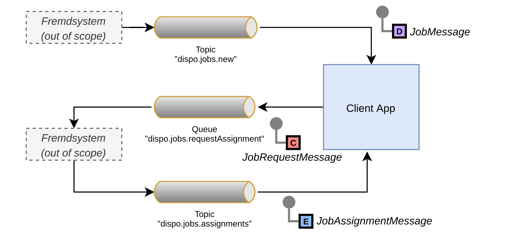
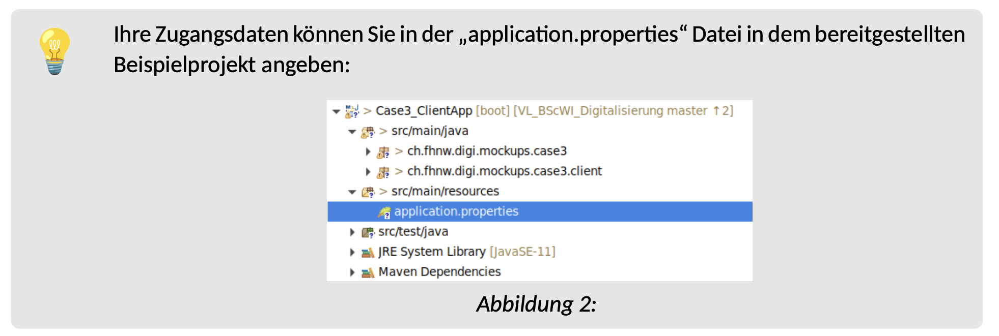

## Problemfall 3

## Beispielhafte Umsetzung

FS

FHNW, Marc Schaaf - Software Architecture


## Inhaltsverzeichnis

- 1. Umsetzung
   - 1.1.Vorhandene Channels
- 2. ActiveMQ Message Broker
   - 2.1.Zugriff auf ActiveMQ


## 1. Umsetzung

```
Die vereinfachte Lösung für die Umsetzung, entspricht nicht dem kompletten Lösungskon-
zept.
```
Um den Umfang der Lösungsumsetzung gering zu halten, genügt es eine um die folgenden Punkte
vereinfachte Lösung zu implementieren:

- Es können alle Aufträge, egal ob Reparatur oder Wartung an den Client geschickt werden.
- Der Client muss keine Filterung (z.B. anhand der Region implementieren).
- Die Disposition akzeptiert immer alle Auftragszuweisungen. Der Client kann entsprechend auch
    davon ausgehen das keine Auftragszuweisung abgelehnt wird.

Basierend auf diesen Vereinfachungen, soll die implementierte Lösung wie folgt aufgebaut sein:


```
Abbildung 1: Vereinfaches Lösungskonzept für die Umsetzung
```
# 💡

```
Auf Moodle steht ein Beispielprojekt für die Umsetzung des Clients bereit. In diesem
ist bereits eine einfache, für die Umsetzung hinreichende GUI enthalten. In diem Beispiel-
projekt muss lediglich noch das nötige Senden und Empfangen von Nachrichten ergänzt
werden.
Die in der Grafik dargestellten Fremdsysteme sind bereits umgesetzt und in Betrieb.
```
### 1.1.Vorhandene Channels

- **Neue Aufträge** können über das folgende **Topic** erhalten werden:
    ‣dispo.jobs.new
    ‣Nachrichtentyp: JobMessage
    ‣ein neuer Job wird alle 2 Sekunden verschickt.
- **Anfragen zur Auftragszuteilung** müssen an die folgdende **Queue** geschickt werden:
    ‣dispo.jobs.requestAssignment
    ‣Nachrichtentyp: JobRequestMessage
- **Antworten auf die Anfragen** werden über die folgendes **Topic** verteilt:


```
‣dispo.jobs.assignments
‣Nachrichtentyp: JobAssignmentMessage
‣Die Antwort auf eine Anfrage wird in ca. einer Sekude verschickt.
```
Die jeweiligen Nachrichtentypen sind in dem bereitgestellten Projekt bereits als passende Java-Klassen
definiert.


## 2. ActiveMQ Message Broker
Bitte beachten: Für die zu erstellende Lösung ist der ActiveMQ Broker bereits bereitgestellt und muss nicht auf ihrem eigenen Rechner gestartet werden.

Für die Umsetzung steht ein Apache ActiveMQ Message Broker zur Verfügung über welchem zudem
auch über vogegebende Channels breits Aufäge erhalten werden und Dispositionsentscheidungen
angefordert werden können.

### 2.1.Zugriff auf ActiveMQ

Broker ist unter folgender Adresse erreichbar:

- **Host:** 192.168.111.
- **Port:** 61616 für JMS
- **Benutzer/Passwort:** _siehe Moodle_

# 💡

```
Ihre Zugangsdaten können Sie in der „application.properties“ Datei in dem bereitgestellten
Beispielprojekt angeben:
```

```
Abbildung 2:
```
Bei Bedarf findet sich eine Übersicht über die aktuell aktiven Channels im Web-Interface von ActiveMQ:

- Zugangsdaten für das Web-Interface:

```
‣Benutzer: admin
‣Passwort: admin
```
- Queues: [http://192.168.111.6:8161/admin/queues.jsp](http://192.168.111.6:8161/admin/queues.jsp)
- Topics: [http://192.168.111.6:8161/admin/topics.jsp](http://192.168.111.6:8161/admin/topics.jsp)

```
Für die eingangs beschiebene Minimalumsetzung ist es nicht nötig eigene Queues / Topics
zu erzeugen. Wenn sie dies jedoch dennoch testen möchten, ist dis auf dem gegebenen
ActiveMQ Broker möglich. Allerdings müssen alle eigenen Topics / Queues immer mit dem
Gruppennamen gefolgt von einem Punkt beginnen.
Bsp.: group1.myTopic
```

